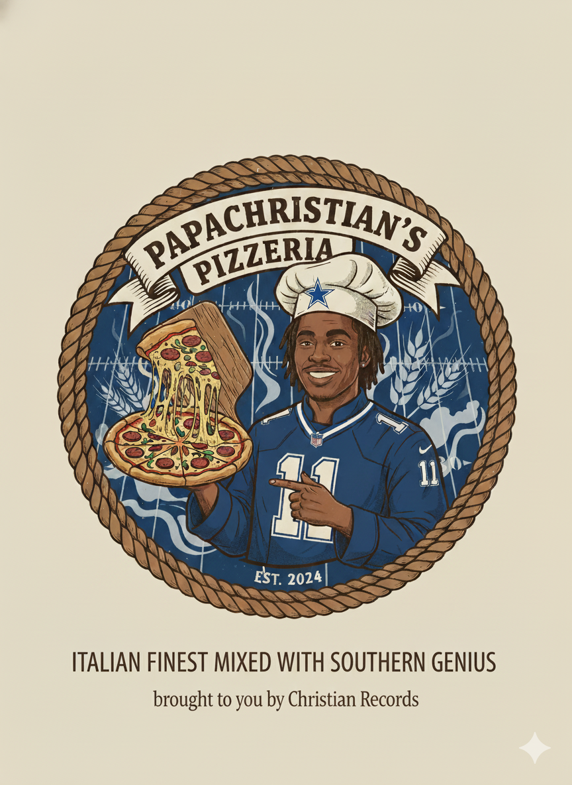

<h1 align="center">🍕 Papa Christian’s Pizzeria </h1>

<div align="center">
  
  </div>

<b><i>Italian Finest Mixed With Southern Genius</i></b><br>
<sub>"Better Pizza, Papa Christian"</sub> 
<br><br>

  

---

## 📖 Description

Papa Christian’s Pizzeria is a **Java console-based food ordering application** that lets customers:

- Build fully custom pizzas
- Order specialty pizzas with preset toppings
- Add drinks
- Add garlic knots
- Customize toppings (add/remove)
- Generate a **printable receipt** saved to your receipts folder

This project demonstrates **Object-Oriented Programming**, **inheritance**, **interfaces**, and **file writing**.  
The program flow was intentionally designed to feel like a real ordering experience inside a terminal.

---
The system also includes:
- A **receipt generator** that saves timestamped receipts to  
  `src/main/resources/receipts/`
- A **customization system** allowing the user to add or remove toppings
- A clean ordering menu with checkout confirmation

---

## ⭐ Features

### 🍕 **Custom Pizzas**
- Choose size (small, medium, large)
- Choose crust type
- Add unlimited toppings:
    - Meats
    - Cheeses
    - Veggies
- Optionally add **stuffed crust**
- Dynamically calculated pricing based on size & toppings

---

### ⭐ **Specialty Pizzas**
Preset pizzas include:
- **Margherita**
- **Veggie**
- **Meat Lovers**
- **BBQ Chicken**
- **Hawaiian Pizza**

Each includes preset toppings AND can still be customized:
- Add toppings
- Remove toppings

Each specialty pizza has its own **extraCharge**, added to the final price.

---

### 🧄 **Garlic Knots**
- Input quantity
- Automatically multiplies quantity × price

---

### 🥤 **Drinks**
- Choose flavor
- Choose size (S / M / L)

---

### 🧾 **Receipt Generation**
- Every order generates a professionally formatted receipt
- Stored automatically in:

----
## UML Class Diagram SS


---
## Loading Screenshot Steps:
### Loading screen demo


### Specialty pizza demo


### Checkout demo


---
### Receipt demo


---

## ⭐ Interesting Code Snippet: Pizza Pricing Logic

This method is one of the most challenging and interesting pieces of the project. It handles:

- Base price by pizza size
- Stuffed crust surcharge
- Specialty pizza surcharge
- Free regular toppings (first 3)
- Premium topping charges
- Final rounding for currency

```java
public double getPrice() {
        double price = 0.0;
        if (size.equalsIgnoreCase("small")) {
            price = 7.40;
        }
        else if (size.equalsIgnoreCase("medium")) {
            price = 9.40;
        }
        else if (size.equalsIgnoreCase("large")) {
            price = 12.33;
        }

        price += toppings.size() * 1.00;

        if (stuffedCrust) {
            price += 1.50;
        }

        double meatPrice = 0.0;
        if (size.equalsIgnoreCase("small")) {
            meatPrice = 1.00;
        } else if (size.equalsIgnoreCase("medium")) {
            meatPrice = 2.00;
        } else if (size.equalsIgnoreCase("large")) {
            meatPrice = 3.00;
        }
        price += meats.size() * meatPrice;


        double cheesePrice = 0.0;
        if (size.equalsIgnoreCase("small")) {
            cheesePrice = 0.75;
        } else if (size.equalsIgnoreCase("medium")) {
            cheesePrice = 1.50;
        } else if (size.equalsIgnoreCase("large")) {
            cheesePrice = 2.25;
        }
        price += cheeses.size() * cheesePrice;

        return price;
    }
```


### removeTopping() overview

- wasn't really needed for capstone but i thought it'd be cool to be able to remove a topping on a specialty pizza if someone didnt want ham on there hawaiian pizza for religious reason's.

### `removeTopping(String topping)`

Removes a specified topping from the `meats`, `cheeses`, and `toppings` lists. The removal is case-insensitive.

```java
public void removeTopping(String topping) {
    for (int i = 0; i < meats.size(); i++) {
        if (meats.get(i).equalsIgnoreCase(topping)) {
            meats.remove(i);
            i--;
        }
    }
    for (int i = 0; i < cheeses.size(); i++) {
        if (cheeses.get(i).equalsIgnoreCase(topping)) {
            cheeses.remove(i);
            i--;
        }
    }
    for (int i = 0; i < toppings.size(); i++) {
        if (toppings.get(i).equalsIgnoreCase(topping)) {
            toppings.remove(i);
            i--;
        }
    }
}
```
## ⭐ Interesting Code part 2
 # added anscii & ascii art to the user interface!
-The welcome sign for Papa Christians is done in ascii art for aesthetics and improved ui experience!
```                                                                                                                                                
▖  ▖    ▝▜                       ▗          ▗▄▄                  ▗▄ ▐        ▝       ▗   ▝                  ▗▄▄  ▝                   ▝       ▗  
▌▐ ▌ ▄▖  ▐   ▄▖  ▄▖ ▗▄▄  ▄▖     ▗▟▄  ▄▖     ▐ ▝▌ ▄▖ ▗▄▖  ▄▖     ▗▘ ▘▐▗▖  ▖▄ ▗▄   ▄▖ ▗▟▄ ▗▄   ▄▖ ▗▗▖  ▄▖     ▐ ▝▌▗▄  ▗▄▄ ▗▄▄  ▄▖  ▖▄ ▗▄   ▄▖  ▐  
▘▛▌▌▐▘▐  ▐  ▐▘▝ ▐▘▜ ▐▐▐ ▐▘▐      ▐  ▐▘▜     ▐▄▟▘▝ ▐ ▐▘▜ ▝ ▐     ▐   ▐▘▐  ▛ ▘ ▐  ▐ ▝  ▐   ▐  ▝ ▐ ▐▘▐ ▐ ▝     ▐▄▟▘ ▐    ▞   ▞ ▐▘▐  ▛ ▘ ▐  ▝ ▐  ▐  
▐▌█▘▐▀▀  ▐  ▐   ▐ ▐ ▐▐▐ ▐▀▀      ▐  ▐ ▐     ▐   ▗▀▜ ▐ ▐ ▗▀▜     ▐   ▐ ▐  ▌   ▐   ▀▚  ▐   ▐  ▗▀▜ ▐ ▐  ▀▚     ▐    ▐   ▞   ▞  ▐▀▀  ▌   ▐  ▗▀▜  ▝  
▐ ▐ ▝▙▞  ▝▄ ▝▙▞ ▝▙▛ ▐▐▐ ▝▙▞      ▝▄ ▝▙▛     ▐   ▝▄▜ ▐▙▛ ▝▄▜      ▚▄▘▐ ▐  ▌  ▗▟▄ ▝▄▞  ▝▄ ▗▟▄ ▝▄▜ ▐ ▐ ▝▄▞     ▐   ▗▟▄ ▐▄▄ ▐▄▄ ▝▙▞  ▌  ▗▟▄ ▝▄▜  ▐  
                                                    ▐                                                                                           
                                                    ▝                                          
```                                                    

-When an order is added the whole display turns green for aesthetics, turns all red when there is an error
(also for aesthetics but a sign something is wrong)... etc!
 ```java
    public static final String RED = "\u001B[31m";
    public static final String GREEN = "\u001B[32m";
    public static final String YELLOW = "\u001B[33m";
    public static final String RESET = "\u001B[0m";
```
- example of addition of (GREEN) to println
```java 
System.out.println(GREEN + "Custom pizza added!");
```
## Project board link ⭐
https://github.com/ConquerorCoder/capstone-2/projects?query=is%3Aopen